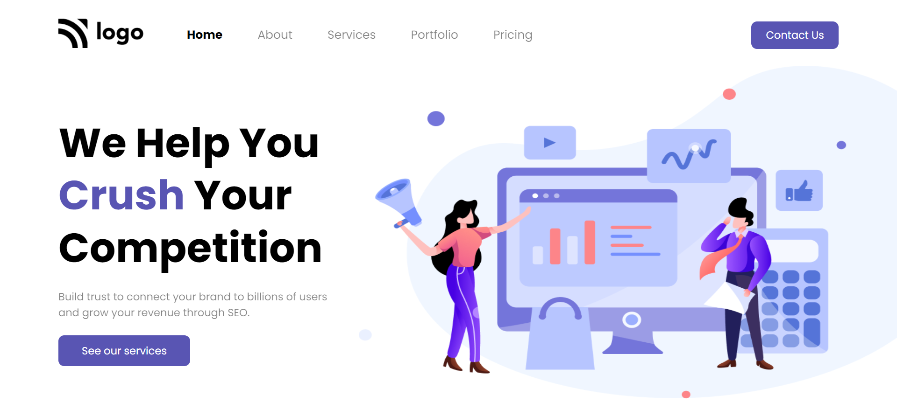

## PROJECT NAME: Digital Marketing Page

### **💻TECH STACK USED IN THIS PROJECT:** 
- 
- 

### **🛠WHAT I HAVE LEARNT IN THIS PROJECT:** 
- Setting an image using Absolute Positioning
- designing Buttons 
- Padding
- hover effect
- CSS Selectors
- CSS Flex-box

### **⌛TIME TAKEN TO COMPLETE THIS PROJECT:** 
- I have taken 1 hour to complete this project.

### **👀HOW MY PROJECT LOOKS LIKE:**

### 💻It works only in **LAPTOP**(Not Responsive).

### **🚀LIVE LINK:**
-  This project is hosted on **Netlify**.You can Check it live using below link: 
-  [Project Live Link !](https://631b63d7ce8de1211c1dc683--legendary-hotteok-d69e02.netlify.app/)

